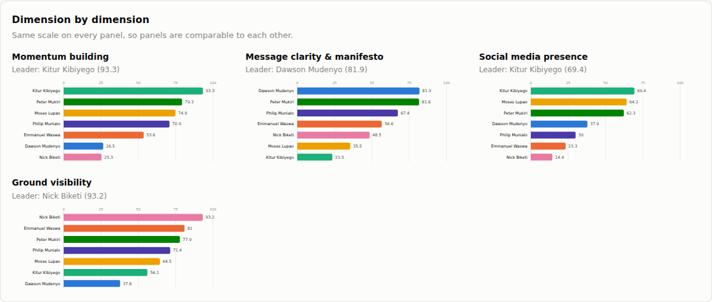

# PulseScope

Launch a plain-English question, get a scraped, scored, ranked answer.

```
Rate Philip Munialo against Moses Lupao, Emmanuel Waswa, Dawson Mudenyo,
Peter Mukiri, Kitur Kibiyego and Nick Biketi, in terms of momentum building,
message clarity and manifesto, social media presence and ground visibility.
```

That sentence is the whole input. PulseScope parses the names and the
dimensions out of it, fans out across social platforms, news and the open web,
scores each person on each dimension, and returns a ranked scoreboard with the
evidence behind every number.



---

## Quick start

```bash
cd pulsescope
pip install -r requirements.txt
cp .env.example .env          # optional, but see "Getting real data" below

python run.py                 # web UI at http://127.0.0.1:8000
```

Or from the terminal:

```bash
python cli.py "Rate Philip Munialo against Moses Lupao and Nick Biketi \
  in terms of momentum building and ground visibility"

python cli.py --actors                    # which scrapers are ready
python cli.py "..." --csv out.csv --json out.json --verbose
```

---

## Getting real data — read this first

**Out of the box PulseScope returns simulated figures.** Every platform worth
scraping either requires an API key or blocks anonymous scraping. Rather than
quietly returning nothing, the app runs a clearly-labelled synthetic generator
so you can see the whole pipeline work — and it marks those numbers as
simulated in the UI, in the CSV, in the JSON and in the run log. **Do not quote
a simulated number.**

To get real numbers, put credentials in `.env`. Each one switches on its actor
independently — there is no all-or-nothing:

| Platform | Variable | Where to get it | Free? |
|---|---|---|---|
| Google News | *(none)* | works immediately | yes |
| Reddit | *(none)* | works immediately | yes |
| Wikipedia | *(none)* | works immediately | yes |
| YouTube | `YOUTUBE_API_KEY` | Google Cloud Console → YouTube Data API v3 | yes, 10k units/day |
| X / Twitter | `X_BEARER_TOKEN` | developer.x.com → Keys and tokens | paid tier |
| Facebook | `META_ACCESS_TOKEN` | developers.facebook.com → Graph API Explorer | yes |
| Instagram | `META_ACCESS_TOKEN` + `IG_BUSINESS_ACCOUNT_ID` | same app, IG Business account | yes |
| TikTok | `TIKTOK_ACCESS_TOKEN` | developers.tiktok.com → Research API | approval needed |
| Open web | `SERPER_API_KEY` or `BRAVE_API_KEY` | serper.dev / brave.com/search/api | free tiers |

Three actors work with no key at all, so a fresh clone with working internet
already returns live press, Reddit and Wikipedia coverage. `python cli.py
--actors` tells you exactly what is ready and what is dormant.

### One honest caveat

There is no legitimate way to keyword-search Facebook, Instagram or TikTok for
"everything anyone said about person X" — Meta and TikTok simply do not expose
that, and bypassing them with a headless browser breaks their terms of service
and gets the account banned. So those actors read what the APIs actually
permit: Facebook and Instagram resolve the subject to their own Page/creator
account and read its posts; TikTok uses the Research API's keyword query. For
opponents who have no Page, coverage comes from press, web search, X and
YouTube instead. That is a real limitation of the platforms, not something a
better scraper fixes.

---

## What the four scores mean

Each score is 0–100 and is computed in two stages: a raw, interpretable value
from the subject's own corpus, then a blend of **60% relative** (where they sit
in this cohort) and **40% absolute** (a saturating curve on the raw value). The
blend matters — pure ranking would hand the top of a weak field a perfect
score, and a pure absolute scale would flatten a tight race.

**Momentum building** — is attention accelerating?
mention volume in the recent third of the window vs the earlier third,
engagement growth over the same split, an exponentially recency-weighted
volume, and the density of momentum language (surge, defection, endorsement).

**Message clarity & manifesto** — is there a message, and is it specific?
topic concentration (how tightly the vocabulary clusters — low entropy over the
top 30 terms), policy-word density, commitment language, the share of items
containing actual numbers, and explicit manifesto/pledge signals.

**Social media presence** — how much surface area?
platform breadth, post volume, total engagement, largest audience, and posting
consistency (how many distinct weeks are active).

**Ground visibility** — is anything happening offline?
density of field-activity vocabulary (rally, baraza, harambee, ward, roadshow,
door-to-door — English and Swahili), the share of items mentioning a physical
event, diversity of activity types, and the share of local press coverage that
describes field activity.

Two extra dimensions — **public sentiment** and **audience reach** — are
available by naming them in the prompt.

Every component value is returned alongside the score, and the UI shows the
real items that drove it. Nothing is a black box.

---

## The prompt parser

It handles the shapes people actually type:

| Prompt | Parsed as |
|---|---|
| `Rate A against B, C and D in terms of momentum and ground visibility` | 4 subjects, 2 metrics, A is the focus |
| `Compare Safaricom against Airtel Kenya on momentum and social media presence` | bare "on" starts the metric clause |
| `rank X, Y and Z in Bungoma county on ground visibility` | locality `Bungoma county` narrows every search |
| `analyse Nike versus Adidas in the United States on sentiment` | region → `US` |
| `compare Jane Doe vs John Smith over the last 30 days` | 30-day window, default metrics |
| `rate A against B only on tiktok` | TikTok actor only |

Check it before spending a run: `python cli.py --parse-only "<prompt>"`, or
`POST /api/parse`. If it mis-reads a name, override it — the API takes explicit
`subjects` and `metrics` arrays.

---

## API

| Endpoint | Purpose |
|---|---|
| `POST /api/launch` | Run a prompt. `{"prompt": "...", "region": "KE", "lookback_days": 90}`. Pass `"async_run": true` to get a job id back immediately. |
| `POST /api/parse` | Show how a prompt parses, without running it. |
| `GET /api/runs/{id}` | Fetch a finished run. |
| `GET /api/runs/{id}/scores.csv` | Scoreboard as CSV. |
| `GET /api/runs/{id}/mentions.csv` | Sample items as CSV. |
| `GET /api/actors` | Which actors are ready, which are dormant and why. |
| `GET /api/health` | Liveness + actor count. |

Interactive docs at `/docs` once the server is running.

---

## Adding a platform

An actor is one class. Drop it in `app/actors/` and add it to the list in
`app/actors/__init__.py`:

```python
class LinkedInActor(Actor):
    name = "linkedin-search"
    platform = "linkedin"
    requires = ("LINKEDIN_TOKEN",)
    description = "LinkedIn posts mentioning the subject."

    def credential(self) -> str:
        return settings.linkedin_token

    async def fetch(self, subject: str, ctx: RunContext) -> list[Mention]:
        resp = await ctx.client.get(url, params={"q": ctx.term(subject)})
        resp.raise_for_status()
        return [Mention(subject=subject, platform=self.platform, actor=self.name, ...)]
```

The base class handles concurrency, timeouts, retries, error isolation (one
failing actor never kills a run) and the run-log entry. `ctx.term(subject)`
gives you the search string with any locality already folded in.

---

## Layout

```
pulsescope/
├── run.py               # start the web UI
├── cli.py               # terminal interface
├── app/
│   ├── main.py          # FastAPI routes
│   ├── query_parser.py  # prompt → structured Query
│   ├── orchestrator.py  # fan out, filter, dedupe, narrate
│   ├── scoring.py       # the four metrics
│   ├── models.py        # Mention, MetricScore, RunResult…
│   ├── actors/          # one file per platform
│   ├── nlp/             # sentiment, keyword families, entropy
│   └── static/          # the dashboard (no build step, no CDN)
└── tests/
```

Tests: `python tests/test_pulsescope.py` (or `pytest tests -q`). 20 tests
covering the parser, the NLP helpers, each metric's directional behaviour,
score bounds, and a full end-to-end run.

---

## Using this responsibly

This tool aggregates public statements about public figures and scores what it
finds. Some things it cannot do, and you should not read into it:

- **It measures coverage, not truth.** A candidate with a well-funded comms team
  outscores one doing quiet, effective work. Loud is not the same as good.
- **Ground visibility is inferred from text**, not from attendance counts. It
  tells you how much reported field activity exists, which correlates with — but
  is not — actual turnout.
- **Small corpora are noisy.** Under ~20 items a subject's scores swing on
  single articles. The item count is shown next to every score for exactly this
  reason; treat a thin corpus as "unknown", not "low".
- **Sentiment is lexicon-based.** It catches obvious polarity and misses irony,
  sarcasm and code-switching.
- **Coverage is uneven across subjects.** A person with a Facebook Page gets
  data an opponent without one does not. Compare the item counts before
  comparing the scores.

Respect each platform's terms of service and rate limits. Use official APIs —
which is what the shipped actors do.
